# GNNs for Simulating Physical Phenomena on Graphons  

**A Report on Methodology, Implementation, and Theoretical Insights**  

---

## Abstract  

This report explores the use of **graph neural networks (GNNs)** to approximate physical phenomena on networks sampled from graphons. 
We focus on three phenomena—heat diffusion, random walks, and bond percolation—and demonstrate how graphons serve as a theoretically grounded framework for generating training data. 

---

## 1. Graphons: A Primer  
### 1.1 Definition  
A **graphon** is a measurable function $W: [0,1]^2 \to [0,1]$ that represents the limit of dense graph sequences. It encodes the probability of an edge between two nodes $u,v \in [0,1]$ as $W(u,v)$. Graphons generalize stochastic block models and enable sampling of graphs of arbitrary size while preserving structural properties.  

### 1.2 Role in This Project  
Graphons act as **generators** for synthetic graphs. By sampling node coordinates $\{x_i\} \subset [0,1]$ and connecting nodes $i,j$ with probability $W(x_i,x_j)$, we create:  
- Diverse training graphs (varying sizes, densities)  
- Theoretically consistent graph sequences for benchmarking  
- A bridge between discrete graphs and continuum limits  

### 1.3 Examples

In ``graphon.ipynb`` we give examples of graphon samples from ``graphon_generator.py``:

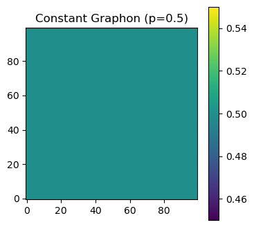 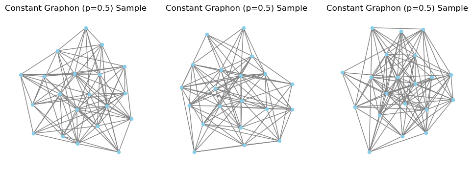
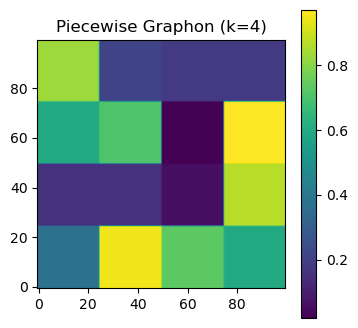 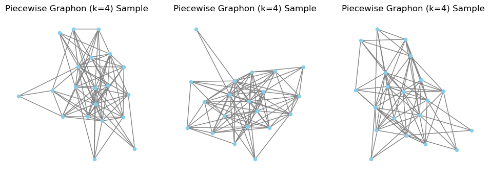
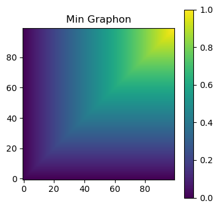 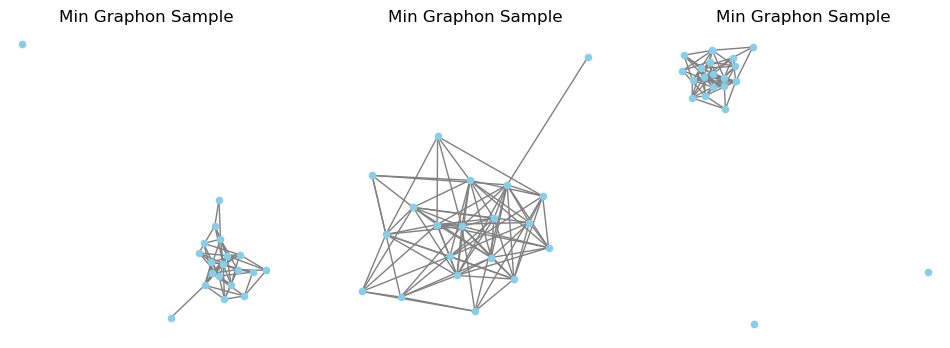
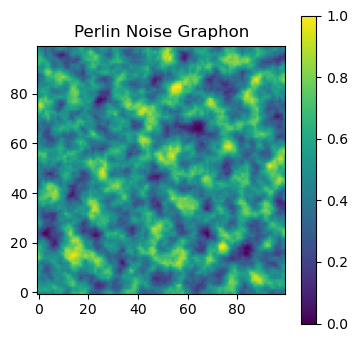 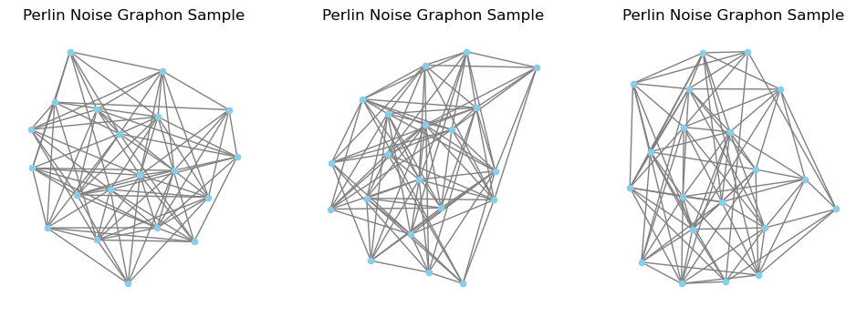

---

## 2. Implemented Physical Phenomena as datasets 
### 2.1 Heat Diffusion  
**Phenomenon**: Steady-state temperature distribution under Dirichlet boundary conditions (fixed-temperature nodes).  
**Modeling**:  
- Solve $L\mathbf{T} = -\mathbf{q}$ where $L$ is the graph Laplacian and $\mathbf{q}$ is the heat source vector.

**GNN Approach**:  
- **HeatGCN**: Node-level regression (GCN layers) to predict final temperatures. Input: initial temps; Output: steady-state temps.  

### 2.2 Random Walks  
**Phenomenon**: Node visitation patterns from length-$L$ random walks.  
**Modeling**:  
- Generate walks via transition matrix $P = D^{-1}A$.

**GNN Approach**:  
- **SkipGramRW**: Node2Vec-inspired embeddings trained via negative sampling on walk sequences.  

### 2.3 Bond Percolation  
**Phenomenon**: Size of connected components after random edge removal (probability $p$).  
**Modeling**:  
- Simulate percolation, assign each node its component size.  

**GNN Approach**:  
- **PercGCN**: Node regression/classification to predict component sizes post-percolation.  

---

## 3. Methodology: From Graphons to GNNs  
### 3.1 Pipeline  
1. **Graphon Generation**: Create $W(u,v)$ (e.g., step functions, rank-based).  
2. **Graph Sampling**: Sample $n$-node graphs from $W$.  
3. **Phenomenon Simulation**: Solve heat diffusion, generate walks, or percolate edges.  
4. **Dataset Construction**:  
   - Heat: $\{(G_i, \mathbf{T}_{init}, \mathbf{T}_{final})\}$  
   - Percolation: $\{(G_i, \mathbf{c})\}$ (component sizes)  
5. **GNN Training**: Learn mappings $G \rightarrow \text{node/sequence outputs}$.  

### 3.2 Theoretical Motivation  
Using graphons ensures:  
- **Data Diversity**: Sampled graphs cover the graphon’s structural spectrum.  
- **Continuum Limits**: GNNs trained on finite graphs may generalize to graphon-defined infinite networks.  
- **Interpretability**: Phenomena can be analyzed via graphon operators (e.g., $T_{final} = L_W^\dagger q$).  

---

## 4. Implementation & Results  
| Model         | Architecture       | Task Type          | Loss           |  
|---------------|--------------------|--------------------|----------------|  
| `HeatGCN`     | 3-layer GCN        | Node regression    | MSE            |  
| `SkipGramRW`  | Skip-gram + NCE    | Embedding learning | NCE loss       |  
| `PercGCN`     | 3-layer GCN        | Node regression    | RMSE           | 

### 4.1 Heat Diffusion

**Dataset**
- Nodes initial state and final state
- 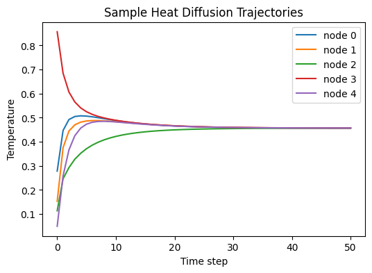

**Metrics**:
- 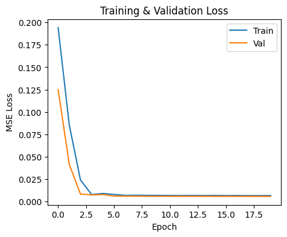 
    - fast convergence
- Held-out MSE: **0.0057** (converged in 5 epochs)  

**Analysis**: Low MSE suggests GCNs effectively approximate Laplacian solvers.  

### 4.2 SkipGramRW

I had issues implementing it, so I decided to remove it from the report.
More precisely: 
- I wanted to take inspiration from: [rusty1s/pytorch_cluster](https://github.com/rusty1s/pytorch_cluster/blob/master/torch_cluster/rw.py).
- But I was unable to properly install the dependencies of [Pytorch Geometric](https://pytorch-geometric.readthedocs.io/en/latest/install/installation.html).

### 4.3 Percolation
**Dataset**
 - 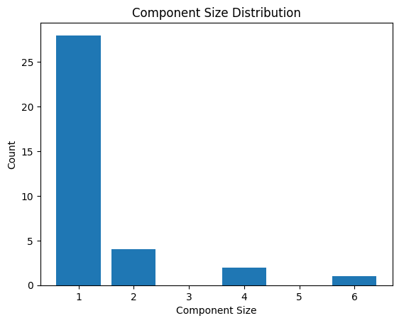

**Metrics**:  
- 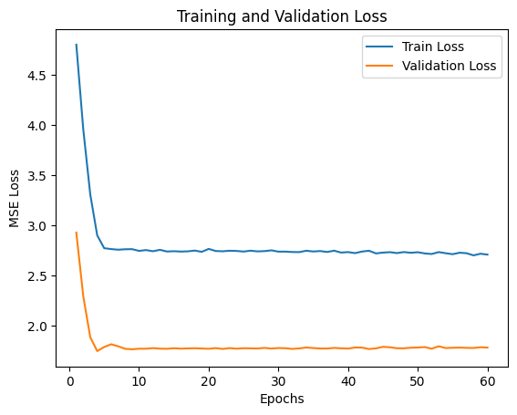
    - fast convergence
- Val RMSE: **1.3539**  
- Giant-component accuracy: **0.3690**  

**Analysis**: Higher RMSE reflects difficulty in predicting discontinuous phase transitions.  

---

## 5. Theoretical Perspectives on GNNs  
### 5.1 GNN Architectures for Physical Modeling  
- **Node-Level Regression** (HeatGCN, PercGCN):  
  - MPNN framework aggregates neighbor info via message passing .  
  - Aligns with elliptic PDE discretizations (e.g., $\nabla \cdot (k\nabla T) = q$).  
- **Embedding Learning** (SkipGramRW):  
  - Implicitly models transition probabilities $P(u \rightarrow v)$.  

### 5.2 Limitations & Future Work  
- **Spectral vs Spatial Methods**: Current GCNs use spatial convolution; spectral methods (via graphon Fourier transforms) may better capture global patterns.  
- **Graphon Continuum Limits**: Analyze GNN generalization to graphon-defined infinite graphs (operator learning perspective ).  
- **Dynamics Modeling**: Replace static GCNs with temporal architectures (e.g., Graph Neural PDE ).  

---

## 6. Conclusion  

By combining graphon-sampled graphs with GNNs, we approximate physical phenomena while maintaining theoretical grounding. Early results validate the feasibility, but capturing phase transitions (percolation) and scaling to graphon limits remain open challenges. Future work could integrate graphon operator theory with GNN architecture design.  